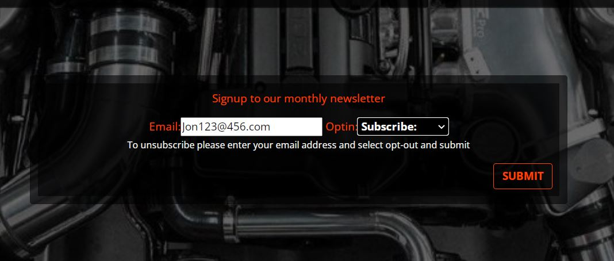
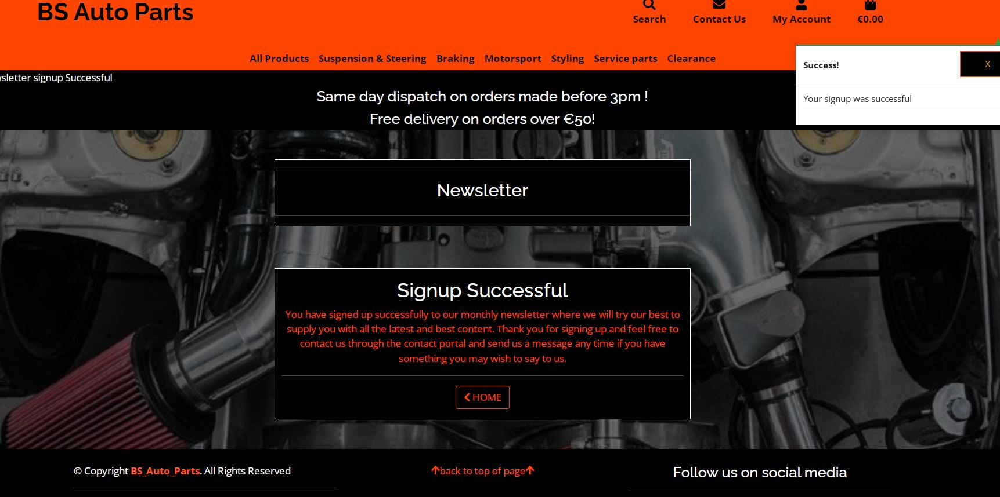
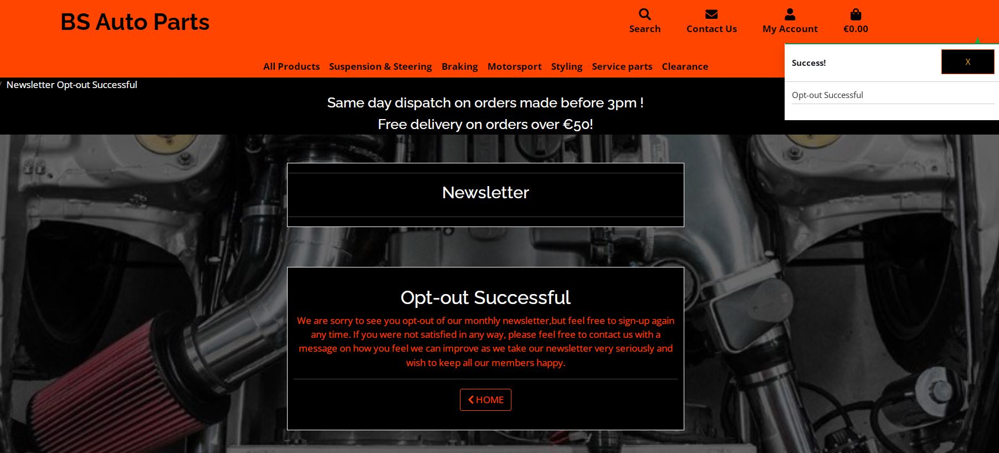
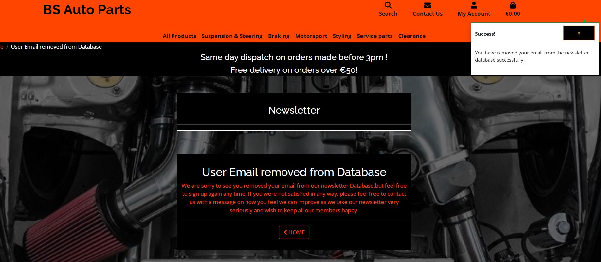
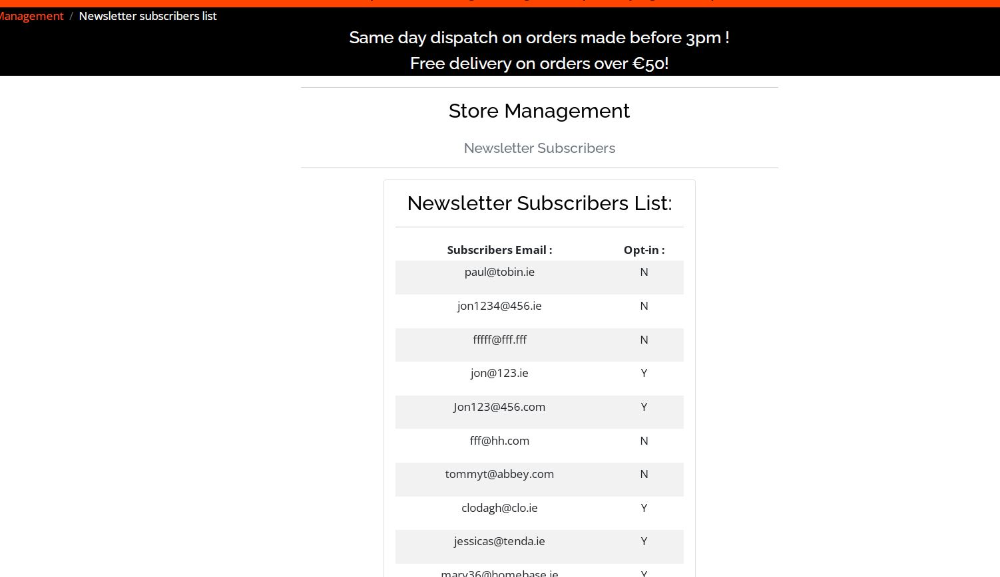
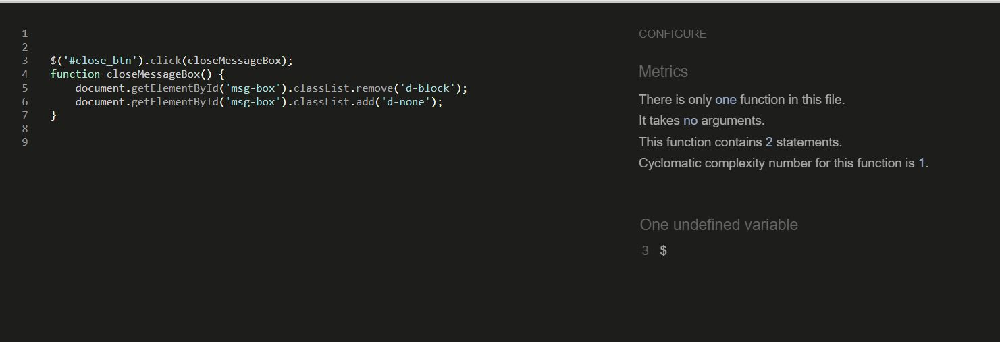
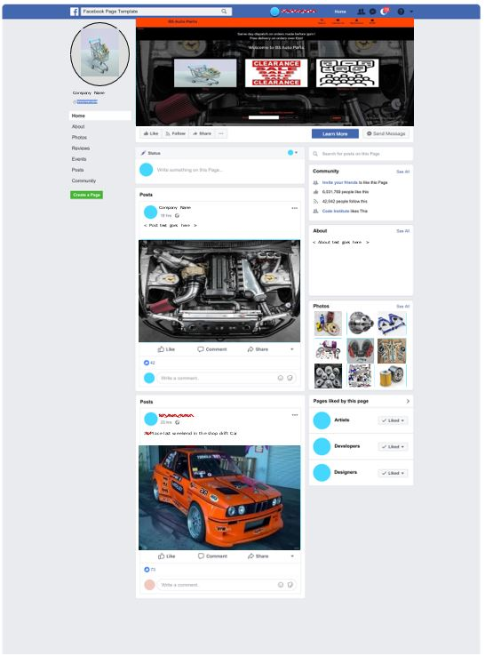

# BRIAN STRITCH P5 - BS_AUTO_PARTS
## Created and developed by Brian Stritch

[**BS_AUTO_PARTS**](https://brian-stritch-p5-bs-auto-parts.herokuapp.com/) is an e-commerce web application and store based on a fictional auto parts and motorsport parts store. [**BS_AUTO_PARTS**](https://brian-stritch-p5-bs-auto-parts.herokuapp.com/) consists of an online shop that caters for the average motorist as much as the motorsport enthusiast. The application is fully functional and allows a purchase to be made with a test Credit card number to display its functionality.
 
 
At [**BS_AUTO_PARTS**](https://brian-stritch-p5-bs-auto-parts.herokuapp.com/) our members can sign-up and login to create a personal profile and can manage their credentials in the user profile page and when signed up can avail of features such as the members forum, where members can discuss topics, have the ability to  comment on existing posts or create their own posts. Users also have the ability to like other users posts and comments.
  

The benefit of this application will allow users to purchase the products they require and also offers the user access to information relating to their vehicles. Should the User wish to discuss any issues they may have they can create a post in the many different Topics and can have other members assistance to help them resolve any issues theymay have.The User has the functionality to edit or delete any posts or comments which they themselves have created.

The users on this website can create reviews on their favourite prducts and can like or unlike a review reated by another member, and the user can also create comments on other reviews left by other members. The users can also like and unlike the comments left by other members.

 

###### Am_I_RESPONSIVE.COM 
#### HOME PAGE

#### SHOP INDEX PAGE 

# View the live site [**here**](https://brian-stritch-p5-bs-auto-parts.herokuapp.com/).

## Table of Contents
1. [**Search Engine Optimisation**](#Search-Engine-Optimisation)
2. [**Web Marketing**](#web-marketing)
    1. [**Social Media Marketing**](#social=media-marketing)
    2. [**Email Marketing**](#email-marketing)
    3. [**GDPR**](#gdpr)
    4. [**Business Model**](#business-model)
        - [**Business to Consumer**](#business-to-consumer)
3. [**UX**](#ux)
    1. [**Users and User Stories**](#users-and-user-stories)
        1. [**Site Users**](#site-users)
        2. [**Admin Users**](#admin-users)
        3. [**Unregistered and Registered Users**](#Unregistered-and-Registered-Users)
        4. [**Users**](#users)
            - [**User Stories**](#user-stories) 
    2. [**Wireframes**](#wireframes)
    3. [**Entity Relationship Diagram (ERD)**](#entity-relationship-diagram-(ERD))
4. [**Features**](#features)
    1. [**Existing Features**](#existing-features)
        1. [**Regular Users**](#regular-users)
        2. [**Staff Users**](#staff-users)
    2. [**Future Features**](#future-features)
5. [**Technologies Used**](#technologies-used)
6. [**Database**](#database)
    1. [**Physical database diagram**](#physical-database-diagram)
    2. [**Database models**](#models)
7. [**Testing**](#testing)
    1. [**User Credentials**](#user-credentials)
        1. [**Test User**](#test-user)
        2. [**Test User Staff**](#test-user-staff)
        3. [**Stripe PAyment Details**](#stripe-pAyment-details)
    2. [**Manual**](#manual)
    3. [**Validation**](#validation)
        1. [**HTML**](#HTML)
        2. [**CSS**](#CSS)
        3. [**JavaScript**](#javaScript) 
        4. [**Python**](#python)
        5. [**Accessibility**](#accessibility)
    4. [**Automated**](#automated)
        1. [**Django / Coverage**](#django-/-coverage)
            1. [**Test Steps**](#test-steps)
        2. [**Unittest**](#unittest)
    5. [**Responsiveness**](#responsiveness)
        1. [**Desktop Size**](#desktop-size)
        2. [**Tablet Size Screen Navigation Menu**](#tablet-size-screen-navigation-menu)
        3. [**Mobile Size Home Page**](#mobile-size-home-page)
        4. [**Mobile Size Home Page Navigation**](#mobile-size-home-page-navigation)
        5. [**Tablet Size Bookings Page Navigation Menu**](#tablet-size-bookings-page-navigation-menu)
        6. [**Tablet Size Reviews Page Navigation Menu**](#tablet-size-reviews-page-navigation-menu)
        7. [**Tablet Size Admin Page Navigation Menu**](#tablet-size-admin-page-navigation-menu)        
    6. [**Bugs Found**](#bugs-found)
8. [**Deployment**](#deployment)
    1. [**GitHub**](#GitHub)
        1. [**To commit the code on GitPod to GitHub**](#to-commit-the-code-on-GitPod-to-GitHub)
    2. [**Heroku**](#heroku)
9. [**Credits**](#credits)
    1. [**Content**](#content)
    2. [**Media**](#media)
    3. [**Acknowledgements**](#acknowledgements)

## Search Engine Optimisation

A description which is relevant and informative has been included in the meta of base.html: 

"BS-Auto_Parts is a high quality high performance vehicle auto parts sales website, hoping to bring the very best in advance automotive service and reliability offering you the finest drifting, racing, and performance parts for all your vehicle maintenance needs and auto repair work"

Utilising Google Search, short keywords and long keyword phases were identified to include across the site to optimise search engine results for the site. These keyword were then run through wordtracker.com to check volume for the search with Google in the UK region.

The list of keywords for the site were narrowed down to:

1. auto parts
2. advance automotive
3. vehicle repair
4. racing
5. drifting
6. performance
7. auto repair
8. vehicle maintenance

These keywords are applied across the website in context and in descriptions. 

## Web Marketing

### Social Media Marketing

A Facebook business page for the store has been set up however this is a standard type account and not a business accoutn. A mock-up business account page has been created and can be seen below. The site is linked to the standard account through the facebook social media link.

A mockup facebook business page has been created which can be seen [**here**](./media/readme/facebook_business_page_mockup.JPG "facebook mockup business page").
 
A standard facebook page has been created to showcase the business and promote the Forum. The facebook page can be found 
<a href="https://facebook.com/BSAutoParts2022/" target="_blank">here</a> .

### Email Marketing

A newsletter sign up is encorporated in the home landing page where a user can sign up to a monthly newsletter showcasing the latest deals and new products featured in the store. To opt in they simply enter their email and select opt-in and submit their details to the Newsletter database. To opt-out the user simply enters their email in the same way as opting in, but selects the opt-out, which opts out the user from the newsletter but keeps their email on file. 

Should a user wish to ne removed from the Newsletter database, then it is the same process as before but select delete and submit their details. Confirmation messages will be shown and a confirmation page will be displayed confirming their action.

newletter signup form

 
newletter signup successful

 
newletter un-subscribe

 
newletter opt-out success message

 
newletter delete from database

 
newletter delete from database successful

 
Admin newletter list

## GDPR

A privacy policy was generated through https://www.privacypolicygenerator.info/ and a link to the policy is available in the page footer.

## Business Model

### B2C – Business-to-consumer

B2C businesses sell to their end-user. This is the business model selected and utilised for BS_Auto_parts. 

* Who is the customer? 
    * The customer is the consumer, the individual by whom the purchased good or service will be used.
* What will they buy?
    * BS_Auto_Parts supplies Automotive parts for the regular maintenance and extends to motorsport applications. A customer would make a once off purchase from the store.
* And how will they pay?
    * All payments will be processed online through stripe.com.
    * They will be secure.
    * Products would require a once off payment to be made.
* What data would need to be collected and stored?
    * The required data to purchase a product would be:
        * Full Name
        * Email Address
        * Credit Card Details
        * Delivery Address Details
        * Phone Number
* Would the customer need to be authenticated?
    * For a once off purchase from the store, the customer would not need an account. However, if they wish to store any of their information within the database they would need to register for an account with BS_Auto_Parts.
* Roles within the e-commerce process:
    * Customer:
        * Orders a product
    * BS_Auto_Parts Site:
       * Creates the customer record on Stripe and the database
       * Creates the order and processes the payment through Stripe
       * Collects address details for delivery
    * Site Owner / Administrator:
        * Arranges delivery of the product to the customer

# UX 
## Users and User Stories
### Site users
This project was designed to allow users to, through CRUD functionality, create read update delete , shopping bag orders, product reviews, forum posts, forum post comments, and the ability to sign up to a newsletter and send a message to the site owners via the contact us form via the navigation menu. In particular;

- Allows users to create an account through the signup form
- Allows users to edit their accounts details on their profile page
- Allows users to delete their accounts from their profile page
- Allows users to view previous order history in the profile page

- Allows users to navigate through the shop easily to find the products they wish to buy
- Allows users to add products to the shopping bag
- Allows users to make purchases through the store

- Allows users to create a review through the create review form displayed on the product details page
- Allows users to edit their review through the edit review form displayed on the product details page
- Allows users to delete their review through the delete review link displayed on the product details page

- Allows registered users the ability to navigate to the Members forum easily
- Allows registered users the ability to navigate to the Members forum categories and topic easily
- Allows registered users to create forum posts through the create post form attached to the forum topic page
- Allows registered users to edit their forum posts through the edit forum posts form attached to the forum topic page
- Allows registered users to delete their forum posts through the delete forum posts link attached to the forum topic page
- Allows registered users to create a comment on another users post through the create comment form attached to the post detail page
- Allows registered users to edit their comment through the edit comment form attached to the post detail page
- Allows registered users to delete their comment through the delete comment link attached to the edit post detail page

### Admin Users
This project was designed to create an online ecommerce store where the site owners have the functionality to create read update and delete, products, product categories, manufacturer categories, forum topics, forum categories, forum posts and forum comments. 
To restrict the type of content displayed on this website any comments or posts or reviews created by a site user, will be sent to the administrator for verification prior to being published. Should a user update a post, comment, review, the status is reset and the post, comment or review, is resent to the administrator for a further approval prior to publishment. 

Any actions carried out by a site user or administrator are accompanied with messages to inform the user of the tasks and their status. 

The administrator has a seperate admin panel, which is not visible to regular site users, to carry out their day to day tasks which can be seen in the images below. The administration panel allows the storeowner to easily navigate via stock control, newsletter subscribers, contact us messages and manufacturer and category lists with further crud functionality to allow the siteowner full unrestricted access to the tasks they may require. 

This website is designed for the regular everyday individuals, however it caters for the motorsport enthusiast and due to the forum, would cater for all types of motor enthusiast, and allows the users to interact and share the knowledge they have gained. The forum has a classified section where users can trade used goods and can advertise for vehicles and parts wanted. 

The forum has a seperate forum admin menu which is not visible to regular site users where the siteowners have access to forms to create forum categories and topics. The Administartor also has edit and delete functionality avilable at the forum topic and ategory headings, which is not visible to the regular users.

The Color scheme throughout the website is based on an orange and black color scheme as the colors are very different giving the user clear visiblity throughout the website. We have also opted to use larer images for better visiblilty of the products on offer so the user can visibly see the product clearly prior to selectin to purchase it. 

I feel that this website satisfies the base requirements in that the users can create, read, update and delete data related to items in the database in an easy to use and visually appealing interface. 

There are a range of apps including shopping bag, checkout, contact us, favourites, forum, home, media, newsletter, product reviews, products, profiles and storeowners that all work together seamlessly to provide a beautifully designed and easy to navigate website that has been designed to appeal to a wide range of users. 

A new user who does not have an account will have access to the homepage (index.html) and to the store, and has limited functionality such as the newsletter optin, and the contact us messenger the signup page, and the login page. They will be unable to access the forum or create reviews or comments on the existing reviews, and should the user attempt to navigate to the forum, they will be redirected to the sign in page, which also offers a link to sign up.  

Once logged in, the members will have access to the sites remaining functionality for creating reviews, commenting and liking reviews, the forum topics, categories, posts and comments and will allow the editing and deleting of reviews,comments and editing content on their personal profile. 

In regards to the contact us messenging service, should an unregistered user wish to contact the administrator, a form is displayed with numerous fields such as the users address and personal details which is added to the database for future reference. A registed user has simply a message text box displayed as the users information will already be on file.

 

### Unregistered and Registered Users
- There are two main user types,
- An admin(administrator) user account has been set up with username/password of testuseradmin/testpassword
- A regular(shopper) user account has been set up with username/password of testuser/testpassword
- When making a payment as a regular user, a test credit card of 4242424242424242 has been set up for the card number
- For the expiry date, cvc and postal code please input 0424 242424
 
Once logged in, staff members have access to the same functionality as members and additonal functionality which is not made available to a regular user for testing purposes and to maintain stock control etc. The staff status allows selected users to access the management area where staff can view all products, categories, manufacturers, newsletter subscribers and contact us messages sent by site users to administration, and allows access to the django administration area where the staff member can view all products, orders, newsletter subscribers, forum categories, reviews, comments, users etc and has administration priveledges which allows them to create edit and update reviews, comments, bookings, users etc. The administration area is required in order to publish posts, comments, reviews etc, which have been submitted for approval prior to getting published.

 

A full breakdown of the pages available within this application can be found by clicking [**here**](https://github.com/BrianStritch/Brian-Stritch-P5-BS_Auto_parts/blob/main/README/site_users_and_admins_views.md)

 

### USERS :

#### User Stories

 

User stories and a canban board have been used in the production of this web application and a full breakdown of the user stories and images of the github issues and canban board are available and can be found by clicking [**here**](https://github.com/BrianStritch/Brian-Stritch-P5-BS_Auto_parts/blob/main/README/user_stories_issues_and_canban.md)

## Wireframes
As there are many pages to this project, I have included the wireframes in a separate document.

Please [**click here**]() to see the wireframes.md file for the entire collection of wireframes.
 

## Site Map

As part of the development of this project, a sitemap was generated using XML-Sitemaps.com (www.xml-sitemaps.com). They provide a free tool which generates an xml file that can be included in the project for google to use. click [**here**](sitemap.xml "Site Map compiled for the application") to seethis files contents.

# Features
### Existing Features
#### Regular Users 
1. Login - The customers are able to create their own accounts and log into the website with secure details.
2. Sign-Up - New users can sign up to create an account.
3. When creating a profile, it will not allow users to create a profile with the same username as another member
4. User Profile - Each user has their own profile that can be udated by the user.
5. Users can create orders and make purchases in the store, whether logged in or not.
6. Users can view their previous order history from the my profile page which is visible to logged in users.
7. Users can select a product and view the product detail page which is visible to all in users.
8. Users can view reviews from past customers from the product details page which is visible to all users.
9. Users can edit or delete their own reviews or comments from the reviews detail page where an edit and delete button are visible to logged in users, but only for reviews or comments which were created by that user. 
10. Registered users can navigate to the members forum to view the latest topics and discussions.
11. Users can select a forum topic to view the post within.
12. Users can create a forum topic post and can edit and delete posts which they have created. 
13. Users can view comments made on each post, and can create comments and edit/delete comments which they have created.
14. Users can sign up to the website newsletter, and can subscribe/ unsubscribe and delete their email from the newsletter database from the fron home page.
15. Users can track their path through the website and can return to the previous page via the navigational breadcrumbs.
16. Users can log out at any time from the site by clicking on the logout button 

#### Staff Users
1. Edit Products - Staff users can edit any products saved to the database using a simple form.
2. Edit Manufacturers - Staff users can edit any manufacturers saved to the database using a simple form.
3. Edit Categories- Staff users can edit any comments saved to the database using a simple form.
4. Delete Products - Staff users can delete any products saved to the database.
5. Delete Manufacturers - Staff users can delete any manufacturers saved to the database.
6. Delete Categories- Staff users can delete any comments saved to the database.
7. Edit Users - Staff users can edit any users saved to the database.
8. Delete Users - Staff users can delete any users saved to the database.
9. Update users status - Staff users can access the administration panel and can update the users access status ie.
   staff/admin/regular user.
10. Create Forum Topics - Staff Users can create new forum topics in the forum
11. Edit Topics - Staff Users can edit forum topics in the forum
12. Delete Forum Topics - Staff Users can delete forum topics in the forum
13. Create Forum Categories - Staff Users can create new forum categories in the forum
14. Edit Categories - Staff Users can edit forum categories in the forum
15. Delete Forum Categories - Staff Users can delete forum categories in the forum

### Future Features
1. A future feature to implement is the ability to post comments on each product review, which due to time constraints i was unable to include in this version due to errors when testing.
2. In a future update i would like to alter the stock quantity when a purchase is made as currently it does not.
3. In a future update i would like to fix the error with the orderlineitems not being addd to the order and via the webhooks.
4. A future update i would like to include would be the ability to like multiple comments and an indicator turning red. currently it only works for the forum posts and due to time constraints i was unable to have this function included in this version due to errors when testing.
5. A simple sign up with social media account will be introduced in a future update as we did not have the timescale to complete in this deployment.
6. A contact link between guests and admin will be established in a future update.

# Technologies Used
- HTML - This site uses HTML to instruct the browser how to interprit the code correctly and arrange the layout.
- CSS - This site uses CSS to aid in the style, and overall theme of the website
- Bootstrap - This site uses Bootstrap elements to help design the framework of the site
- Django - This was the chosen framework for developing the project
- Python - This language was chosen to code the a large amount of the functionality of the site
- JavaScript - this was used to program some of the features on the site, such as the messages timeout
- Balsamiq - This was used to create the wireframes in the design phase
- Heroku - This was chosen to host the website app for deployment.
- Coverage - This reporting tool was installed and used to produce reports showing how much of the apps had been tested
- Postgres - This Relational Datatabase was used to handle the data storage
- Stripe - This is used to handle payments via the online store
- AWS S3 Bucket - This is used as storage for all static and media files

### Libraries and resources
- Bootstrap 5.0 (https://getbootstrap.com/docs/5.0)
    - The project uses the bootstrap library for some UI components in the website (Buttons, Card, Carousel, Modal, Pagination, Navbar)
- Postgres (https://www.postgresql.org/)
  - The deployed project on Heroku uses a Postgres database
- SQLLite (https://www.sqlite.org/index.html)
  - The database uses in local development was a SQLLite database
- Gitpod (https://gitpod.io/)
    - Gitpod was used as the IDE for the project
- Github (https://github.com/)
    - GitHub was used to store the project code in a repository
- Google Fonts (https://fonts.google.com/)
    - Google font Poppins was used as the website font
- Balsamiq (https://balsamiq.com/)
    - Balsamiq was used to create the website wireframes
- Font Awesome (https://fontawesome.com/)
    - Font awesome was used to provide the relevant fonts/icons for the website
- JQuery (https://jquery.com)
    - JQuery was used in some javascript files for DOM manipulation
- CSS Validation Service (https://jigsaw.w3.org/css-validator/)
   - CSS validation service for validation the css in the project  
- HTML Markup Validation Service (https://validator.w3.org/)   
    - HTML validation service for validation the css in the project  
- Chrome dev tools (https://developers.google.com/web/tools/chrome-devtools)
    - For troubleshooting and debugging of the project code
- Chrome Lighthouse (https://developers.google.com/web/tools/lighthouse)
    - For performance, accessibility, progressive web apps, SEO analysis of the project code
- amiresponsive (https://ui.dev/amiresponsive)
    - Website for generating the responsive image in this README
- Python online interpreter (https://www.programiz.com/python-programming/online-compiler/)
    - For testing python code snippets
- Unittest (https://docs.djangoproject.com/en/3.2/topics/testing/overview/)
    - For Python unit testing
- JSHint (https://jshint.com/)
  - For javascript code quality
- PEP8 (https://www.python.org/dev/peps/pep-0008/)
  - I used the pep8 code analysis plugin in Pycharm to check for pep8 errors
- Stripe (https://www.stripe.com)
  - For processing a test credit card to test a payment as part of an order
- Coverage (https://coverage.readthedocs.io/en/6.1.2/)
  - For unit test code coverage reports
- Quick Database diagrams (https://www.quickdatabasediagrams.com)
  - For the database schema diagram

# Database
- The website is a data-centric one with html, javascript, css used with the bootstrap(version 5) framework as a frontend
- The backend consists of Python built with the Django framework with a database of a Postgres for the deployed Heroku version(production)
- Postgres is a powerful, open source object-relational database system (https://www.postgresql.org/)
- A SQLLite database was used for local development (https://www.sqlite.org/index.html)

#### Physical database diagram
This model contains all fields stored in the database collections with their data type and mimics the structure of what is actually stored in the Postgres database
 

[**Database diagram**](/README/ERD.md)

#### Models
- This web application utilises 16 seperate models each serving a different purpose and some relating to each other where necessary. The models include:
  - User
  - Userprofile
  - Manufacturer
  - Category
  - Product
  - Product Review
  - Prouct Review Comment
  - Order
  - OrderLineItem
  - Favourites
  - Forum Category
  - Forum Topic
  - Forum Post
  - Forum Post Comment
  - Newsletter
  - Site users contact details
  - Existing users contact details

A full breakdown of the models can be found [**Here**](https://github.com/BrianStritch/Brian-Stritch-P5-BS_Auto_parts/blob/main/README/models.md)

An ERD Entity relationship diagram can be found [**Here**](/README/ERD.md)

# Testing
### User Credentials
There are two main uses on this site; a site member and a site staff member. Please use the logins below to access and review both user types:

#### Test User
- Username: testuser
- Password: administration

#### Admin User
- Username: admin
- Password: administration

#### Stripe PAyment Details
- Test Card Number: 
    - Card number: 4242424242424242
    - Expiry : 04/24
    - CVV : 242
    - Zip : 424

### Manual Testing

During this process, several issues were discovered and some of which have been since fixed on the site. Some examples of these include;

- The original version of the website allowed users to create product reviews for the seleted products and each review had the ability for users like/unlike the specific reviews, and to create comments and like/unlike the comments. During the early stages of development this functinality was functioning as intended and a review could be created, any user could like/unlike the review, the users could alos create comments on the review and they could like/unlike the comments. For any of the reviews or comments that were liked, if the current user had previously selected to like the review/comment, the heart symbol would turn red and if unliked would turn white. Near the end of developing this application, during manual testing of the site it became apparrant that there was an issue with the logic relating to this. The issue was that the query in the view was querying for a single review in order to display the comments relating to that review and when more than one review was returned an error would arise as the multiple results required itertion in the template and the template was not set up for this. the template was set up for displaying a single instance so when i changed it to suit a multiple response it would throw an error then when a single response or no response was returned from the query. Due to time constraints i had to remove this functionality from the application, but will be implementing it in a future updated version.

- In the shopping bag app and checkout appit was noted that although following the guidelines set out in the boutique ado walkthrough, the order does not appear to be adding items by size and quantity, and if a product is selected and multiple sizes or a quantity higher than 1 then the order does not calculate this and only one item is added. Due to time constratints i have not been able to pinpoint the fault which causes this issue, however this would be a future upate to be added to this application.

- In the forum app, the user has the ability to like and unlike comments, and the toggler is functioning correctly as it is correctly incrementing or decrementing the number of likes, however the red heart icon does change color depending on the current users preferences and due to time constraints this bug will need rectificatin in a future update.

- During manual testing numerous visual errors came to light and the majority of which have been rectified, however some of minor errors still exist, relating to the page width and elements not spanning the full width of the document or the document overflowing beyomd the viewport width.

There are other issues that could not be fixed due to ability / time contraints that have been included in the "Bugs Found" section below. 

### Validation

#### HTML

All HTML pages have been checked using the W3C Markup Validation Service. Some Errors were found in the Edit_profile.html page which relate to the fields automaticaly rendered using crispy forms.

Some of the page urls were raising a 500 error when the validator attempted to test the page, however to avoid this, the page source code was used for testing, however the tool pointed to several small issues on some pages that were of no consequence, such as opening p tags not being found for a closing /p tag, when they were present in the code, however these issues only related to the crispy forms mentioned above.

Please see the w3c-validation.md file for the full breakdown of the HTML W3C validation testing done for this site. You can click [**here**](https://github.com/BrianStritch/Brian-Stritch-P5-BS_Auto_parts/blob/main/README/w3c_html_validation.md) to reach the file. 

#### CSS
The custom.css file code was validated using the The W3C CSS Validation Service and the image below verifies that the code was successfully validated with no errors. Numerous warnings were noted which relate to the bootstrap CSS files inherited with the template, however none of the custom css written for this web application failed or had any warnings present.

All CSS files have been tested and the results of which can be found by clicking [**here**](https://github.com/BrianStritch/Brian-Stritch-P5-BS_Auto_parts/blob/main/README/w3c_validation.md) to reach the file. 

Please see below badges obtained for passing the W3C CSS Validator testing

    

     

    

     

#### PYTHON 

The automated tool yapf has been used to assist in the erradification of linting errors in the python files throughout this application.

All python files have been tested using pep8 online testing platform and all errors have been removed and pep8 testing has passed.
Please see the pep8 testing file for the full breakdown of the pep8 testing done for this site. You can click [**here**](https://github.com/BrianStritch/Brian-Stritch-P5-BS_Auto_parts/blob/main/README/pep8.md) to reach the file. 

#### JavaScript
JS Hint was used to ensure that the JavaScript used in the website had no errors.

### Automated
#### Django / Coverage
Django tests were written and Coverage was used to product detailed reports to ensure the sites apps were tested as much as possible. On testing the applicatin with coverage it was noted that an overall score of 85% was obtained.

1. In the terminal, use: "coverage report"
    - generates a detailed report showing what has/what needs testing

2. In order to product a html report which allows you to inspect in each file, to see in easy to use colour codes the lines of code which have been tested or which have not yet been tested, please use the following command: "coverage html"

##### Coverage Report
[**Click Here for Full coverage report**](https://github.com/BrianStritch/Brian-Stritch-P5-BS_Auto_parts/blob/main/README/coverage.md)

#### Unit test
In order to run tests on GitPod using unittest (which has been installed to handle testing), please follow the below steps in the terminal on GitPod:

1. In BS_Auto_parts settings.py the database needs to be switched to the local database as the tests will not run when on the heroku postgres database. The loal database is kept in commented out form to allow switching of the database for testing purposes.

2. Run the following code : "pyhton3 manage.py test"
    - This will run a test on all test.py files in the app and will display in the terminal if all tests are passing, and if it does not it will show the error causing the test to fail.

### Python
All python code pages have been tested to ensure it meets PEP8 standards and the results of which can be found by clicking [**here**]() to reach the file. 

### Accessibility
All HTML pages have been tested for accessibility and performance using Chrome Devtools Lighthouse testing platform and the results of which can be found by clicking [**here**](https://github.com/BrianStritch/Brian-Stritch-P5-BS_Auto_parts/blob/main/README/accessibility_tests.md) to reach the file. 

### Responsiveness
This website has been designed to scale correctly to different screen sizes with no issues on layout. In order to ensure that the view was pleasant to the user, certain divs and items had to be arranged differently or hidden/shown depending on screen size. This was handled using CSS media queries. Click [**here**](https://github.com/BrianStritch/Brian-Stritch-P5-BS_Auto_parts/blob/main/README/responsive_testing.md) to see images of the application on different sized media screens.

### Bugs Found
- The original version of the website allowed users to create product reviews for the seleted products and each review had the ability for users like/unlike the specific reviews, and to create comments and like/unlike the comments. During the early stages of development this functinality was functioning as intended and a review could be created, any user could like/unlike the review, the users could alos create comments on the review and they could like/unlike the comments. For any of the reviews or comments that were liked, if the current user had previously selected to like the review/comment, the heart symbol would turn red and if unliked would turn white. Near the end of developing this application, during manual testing of the site it became apparrant that there was an issue with the logic relating to this. The issue was that the query in the view was querying for a single review in order to display the comments relating to that review and when more than one review was returned an error would arise as the multiple results required itertion in the template and the template was not set up for this. the template was set up for displaying a single instance so when i changed it to suit a multiple response it would throw an error then when a single response or no response was returned from the query. Due to time constraints i had to remove this functionality from the application, but will be implementing it in a future updated version.

- In the shopping bag app and checkout appit was noted that although following the guidelines set out in the boutique ado walkthrough, the order does not appear to be adding items by size and quantity, and if a product is selected and multiple sizes or a quantity higher than 1 then the order does not calculate this and only one item is added. Due to time constratints i have not been able to pinpoint the fault which causes this issue, however this would be a future upate to be added to this application.

- In the forum app, the user has the ability to like and unlike comments, and the toggler is functioning correctly as it is correctly incrementing or decrementing the number of likes, however the red heart icon does change color depending on the current users preferences and due to time constraints this bug will need rectificatin in a future update.

# Deployment
This project was deployed to Heroku at the address **https://brian-stritch-p5-bs-auto-parts.herokuapp.com/** using the following steps:

### GitHub:
- During the extent of this course we have been using the CI template as a base, and cloning the template by pressing the use this template button, which creates a new repository in your github account. 
- Name your new repository respective of the current project you wish to create.
- Once created, press the green gitpod button which will open the repository in gitpod and will begin installing all the packages and dependencies as per the CI template.

#### To commit the code on GitPod to GitHub:
- In the terminal, type "git add ." to add all new changes to the code to staging area
- Next, type "git status" to see which files are ready to be commited
- Commit these by typing "git commit -m" and adding a detailed description of the commit in ""
- Next, push the code commit to GitHub by typing "git push"

### Heroku:
To see a complete walkthrough of how to create a heroku account, a new app and the heroku deployment process please click [**here**](https://github.com/BrianStritch/Brian-Stritch-P5-BS_Auto_parts/blob/main/README/heroku_deployment.md)
 

### AWS Amazon Web Services
AWS amazon web services was used for sorage of static files and images for this project and to see a full walkthrough of the process involved please click [**here**](https://github.com/BrianStritch/Brian-Stritch-P5-BS_Auto_parts/blob/main/README/aws_walkthrough.md)
 

### Gmail Account setup for the sending of emails from django apps
Google G-Mail was used for this project and to see a full walkthrough of the process involved please click [**here**](https://github.com/BrianStritch/Brian-Stritch-P5-BS_Auto_parts/blob/main/README/gmail_setup.md)
 

### Stripe Account setup for the handling of payments from django apps online store
Stripe was used for this project to manage payments and to see a full walkthrough of the process involved please click [**here**](https://github.com/BrianStritch/Brian-Stritch-P5-BS_Auto_parts/blob/main/README/stripe_setup.md)
 

### Facebook Mock business page
We have created a mock facebook business page based on the CI balsamic template below: 
  

# Credits
### Content
- Font icons imported from FontAwesome.
- The majority of the shop context was inherited from a combination of the Code Institute Walkthroughs and Fellow students input from the CI slack channels and researching past pupils work.
 
### Media
As there are many images for the products in this website, most of which were obtained from Pexels.com, shutterstock.com and some images obtained from facebook and chinese vendor wish.
- Product information and images were obtained from a combination of lengthy searcing on Unsplash,Burst (by Shopify),Pexels,Pixabay,Free Images,Kaboompics,Stocksnap.io,Canva and further images obtained from filtering google search to royalty free.

### Acknowledgements
- I would like to acknowledge my mentor Mo Shami for all of his help and advice with this project
- I would like to thank my friends and family for their testing help and advice with this project
